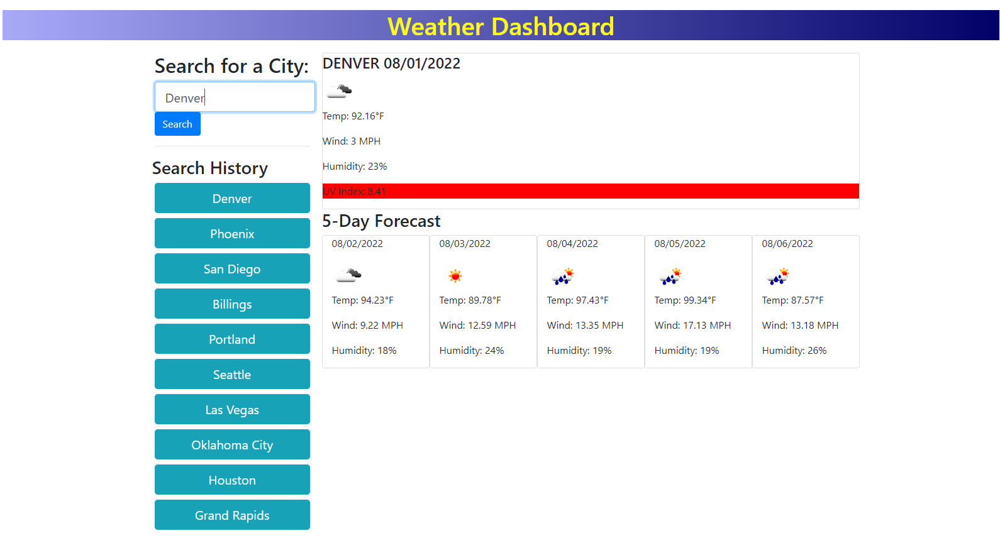

# Weather Dashboard

## Description
Pull weather data from 3rd Party API

## Functionality
- Ability to search for a city to pull up weather
- Loads weather from 3rd party API
- Shows current weather data 
- Displays 5 day forecast
- Saves previous 10 cities searched for
- Added buttons to search hisotry to easily research for that city

## Links
-[Github code link](https://github.com/heintze11/weather-app)

-[Github pages link](https://heintze11.github.io/weather-app/)

## Screenshot
